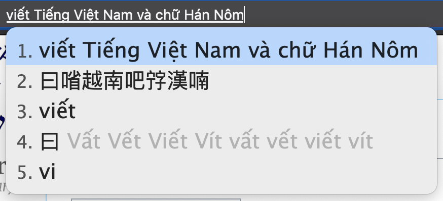

# rime-vietnamese

## About

This is a layout for typing in Vietnamese / Tiếng Việt / Việt Ngữ (越語 / 㗂越). Supports both chữ Quốc ngữ (國語字 / 𡨸國語) and chữ Nôm (喃字 / 𡨸喃)



## Installing

First ensure you have plum installed. For macOS this would be:

```bash
cd ~/Library/Rime
wget https://git.io/rime-install
```

Then install `gkovacs/rime-vietnamese` using plum:

```bash
bash rime-install gkovacs/rime-vietnamese
```

Finally edit `default.custom.yaml` and add `vietnamese` to the schema list:

```bash
patch:
  schema_list:
    - schema: vietnamese
```

Now reload RIME and it should appear under your layouts.
